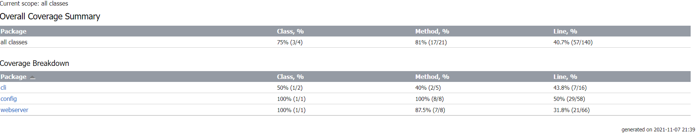
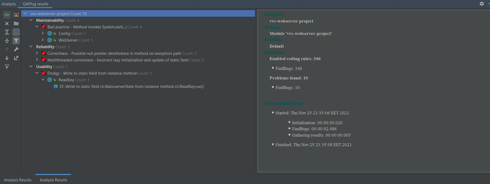
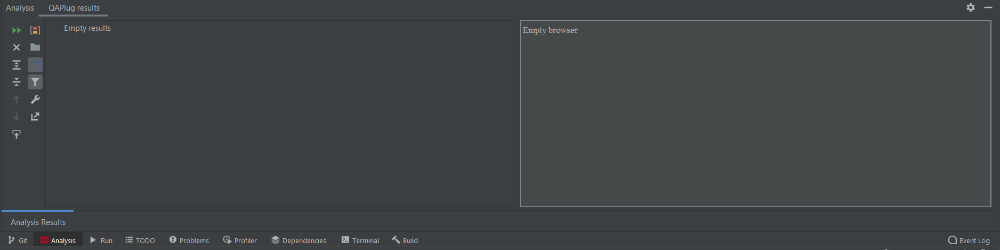
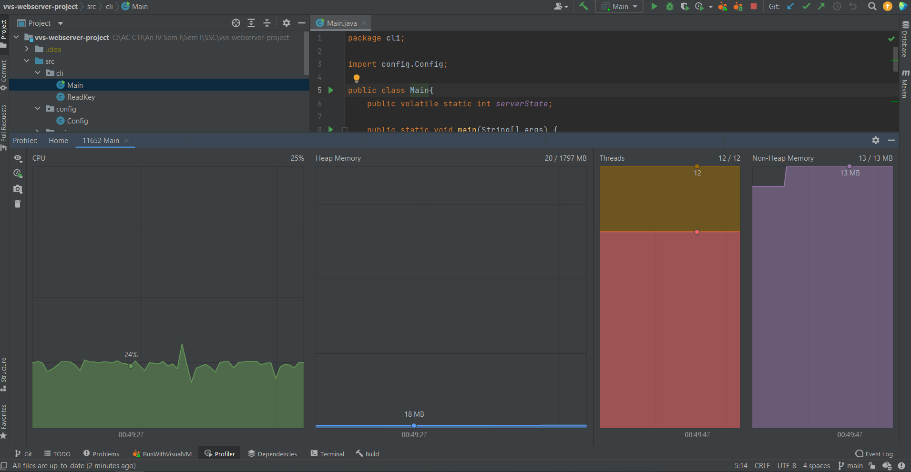
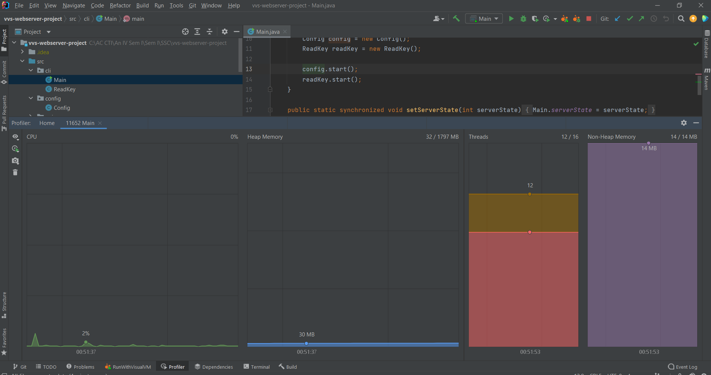
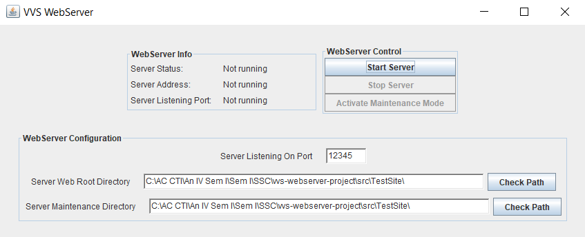
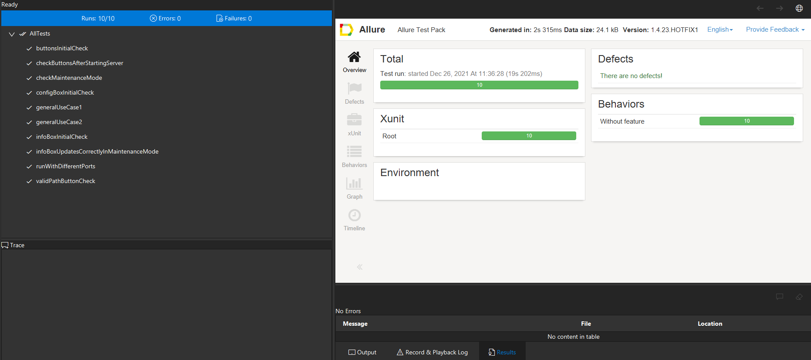
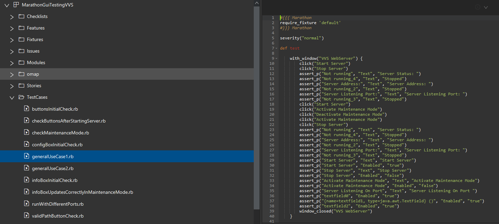

# VVS-Webserver-Project by Danci Ionut Cosmin

# Part 1
Legend:

✓ -> done  
x -> not done  
~ -> partially done

# Implementation:
- Webserver ✓
- Config - CLI ✓
- GUI ✓

# Tests classes implemented:
- ReadKeyTest ✓
- mainTest ~
- configTest ~
- guiTests ~
- WebServerTest ~

Current code coverage: 40.7%

Reason: Should modify WebServer class to make it more testable.

# Part 2 - Updated 26/11/2021

Static Analysis - First Run (FindBugs).

Static Analysis - After fixing bugs (FindBugs).

Dynamic Analysis - First Run (Visual VM).

Dynamic Analysis - Graph after: starting server -> maintain mode activated -> stop server (Visual VM).

Conclusions after dynamic analysis: No memory leaks found, memory and cpu usage seems alright, number of threads seems fine.

# Part 3 - Updated 26/12/2021

 - Finished Implementing GUI
 - Finished 10 tests with Marathon for GUI

Default GUI:

Marathon Tests:

Example of Marathon Test:

