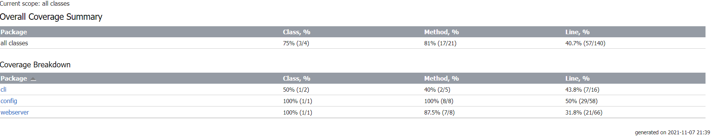

# VVS-Webserver-Project by Danci Ionut Cosmin

Legend:

✓ -> done

x -> not done

~ -> partially done

# Implementation:
- Webserver ✓
- Config - CLI ✓
- GUI x

# Tests classes implemented:
- ReadKeyTest ✓
- cliTest ~
- configTest ~
- guiTests x
- WebServerTest ~

Current code coverage: 40.7%

Status: need help.

Nu am reusit sa fac asa multe teste unitare deoarece nu stiu exact cum ar trebuii sa testez cazurile in care apar metode de multithreading/blocking din codul meu, poate ar trebuii refactorizat si as dorii feedback daca se poate. Multumesc!